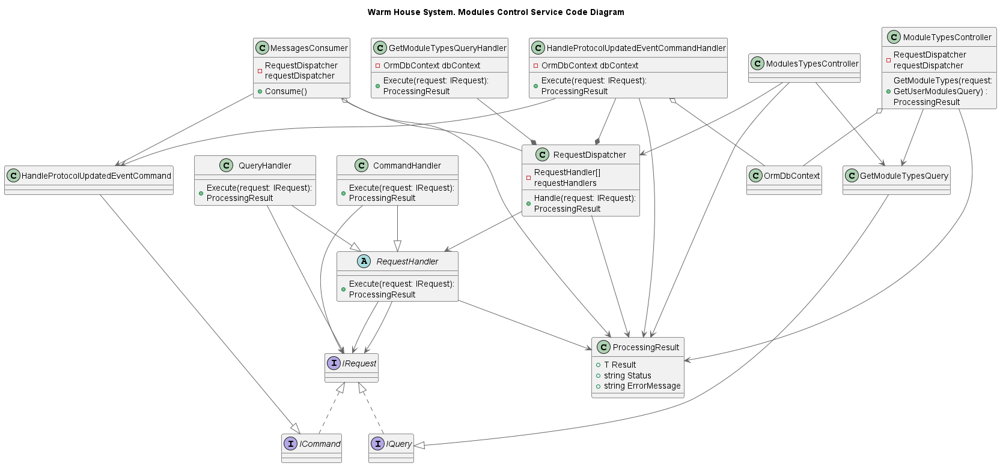

# Project_template

# Задание 1. Анализ и планирование

### 1. Описание функциональности монолитного приложения

**Управление отоплением:**

- Пользователи могут:
  - Просматривать свои устройства для управления отоплением
  - Включать и отключать свое оборудование отопления
 
- Система поддерживает:
  - Обработку запросов пользователей
  - Вызов API устройств для управления отоплением
  - Все вызовы синхронные

**Мониторинг температуры:**

- Пользователи могут 
  - Просматривать свои датчики температуры
  - Просматривать текущую температуру датчиков
- Система поддерживает
  - Обработку запросов пользователей
  - Вызов API датчиков для получения телеметрии
  - Все вызовы синхронные

### 2. Анализ архитектуры монолитного приложения

Архитектура:
-монолитная
Стек:
-Java
-Postgres
Обработка запросов пользователей:
- синхронная, последовательная
Взаимодействие с устройствами:
- сервис выполняет синхронные запросы к оборудованию

### 3. Определение доменов и границы контекстов

- Домен регистрации пользователей, аутентификации и управления доступами
  - Отвечает за создание и управление Пользователями. 
  - Обеспечивает процесс проверки подлинности и выдачу авторизационных Токенов. 
  - Предоставляет управление Ролями пользователей и их Доступами к ресурсам системы.

- Домен типов модулей
  - Отвечает за создание и предоставление типов Модулей

- Домен модулей пользователей
  - Обеспечивает процесс регистрации новых Модулей пользователей. После регистрации Модуля, пользователь должен добавить Модуль в один из своих Домов и задать Модулю имя. В процессе регистрации данные подключения к Модулю пользователя асинхронно сохраняются в сервисе управления модулями выбранного протокола
  - Предоставляет функционал для управления Домами пользователя. Пользователь может добавлять других пользователей в свой Дом и предоставлять им доступ для взаимодействия со своими Модулям.

- Домен управления модулями пользователей
  - Предоставляет информацию о состоянии Модуля
  - Запускает исполнение команд управления модулями и обрабатывает события обработки команд
  - Обрабатывает создание, исполнение и управление пользовательскими сценариями

- Домены управления модулями
  - Предоставляют функционал для взаимодействия с Модулями по поддерживаемым системой протоколам: стандартный протокол SmartHome, прежний протокол WarmHouse, протокол видеопередачи VideoTransfer.. Инкапсулируют особенности взаимодействия по протоколу с Модулями.
  - Предоставляет информацию о том какие модули и команды поддерживает протокол
  - Хранят сведения о Модулях для взаимодействия

### **4. Проблемы монолитного решения**

- Синхронный вызовы оборудования могут привести к снижению производительности, когда потребуется обрабатывать сценарии в рамках запроса. Асинхронная обработка позволит вернуть ответ на запрос с результатом инициации обработки сценария, а результат обработки по мере готовности. Однако потребуется реализовать механизм получения результатов на клиентской стороне: через пуш-уведомления, таймеры или требования от пользователя повторно запросить данные (обновить страницу, компонент, нажать кнопку и т.д.) 
- Проблемы с масштабированием: при горизонтальном масштабировании требуется поднимать инстансы сервиса со всей функциональностью. Разделение системы на сервисы позволит масштабировать только те сервисы, которым это требуется
- Выпуск или обновление функциональности требует обновления всего приложения.
Когда функциональностей станет больше, то это будет аффектить все сервисы и недоступность сервиса может отразиться на пользовательском опыте
Однако следует отметить что при таком небольшом составе команды разработки, поддерживать монолитное приложение комфортнее

### 5. Визуализация контекста системы — диаграмма С4

**C1. Диаграмма контекста (Context)**

# Задание 2. Проектирование микросервисной архитектуры

**Диаграмма контейнеров (Containers)**

***C2. Warm House System. To-Be***

**Диаграмма компонентов (Components)**

***C3. Warm House System. To-Be. Сервис модулей пользователей***

***C3. Warm House System. To-Be. Сервис обработки сообщений управления модулями***

**Диаграмма кода (Code)**

***C4. Warm House System. To-Be. Сервис типов модулей***

# Задание 3. Разработка ER-диаграммы

✅ — вы выполнили задание.

# ✅ Задание 4. Создание и документирование API

### 1. Тип API

Пользовательские запросы будут обрабатываться как синхронно, так и асинхронно, но в новой архитектуре упор сделан именно на асинхронную обработку запросов, чтобы достичь более высокого отклика на долгих операциях, тем самым улучшив пользовательский опыт, а также подготовить систему к масштабированию

### 2. Документация API

[REST API сервиса модулей пользователей](docs\api\user-modules-service.openapi.yaml)

[REST API сервиса типов модулей](docs\api\module-types-service.openapi.yaml)

[REST API сервиса управления модулями пользователя](docs\api\user-modules-control-service.openapi.yaml)

[Async API обработки команды управления модулем](docs\api\module-contol-commands.async-api.yaml)